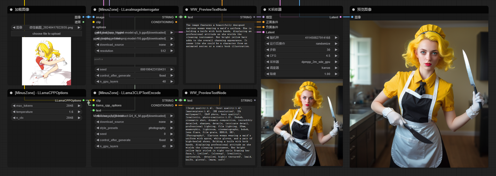

# ComfyUI-Prompt-MZ
Use llama.cpp to assist in generating some nodes related to prompt words, including beautifying prompt words and image recognition similar to clip-interrogator
 

## Installation
1. Clone this repo into `custom_nodes` folder.
2. Restart ComfyUI.
 
## Nodes
+ LLama3CLIPTextEncode
  

+ LLavaImageInterrogator
  

+ BaseLLamaCPPCLIPTextEncode (You can directly pass in the model path)
+ BaseLLavaImageInterrogator (You can directly pass in the model path)

